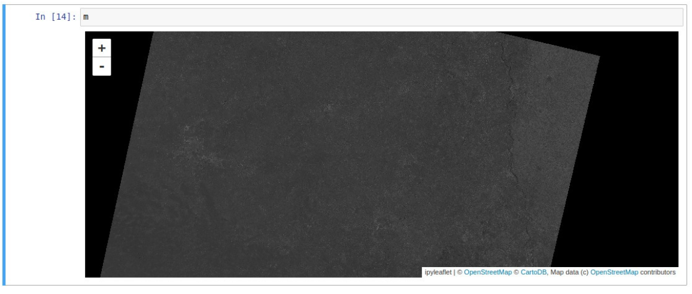

# Custom Python Package
## Introduction
The custom python package is mainly built to interact with the image server to perform remote sensing operations through any python environment. The package maps every opertion
to its URL with the request. <br />
Then, using that URL the user can make a map and render it using ipyleaflet. In all the custom package gives you the url of the web map service with the appropriate request body.<br />

## Methods
There is a method corresponding to each remote sensing operation in the package which can be called through any python environment example Jupyter Notebook. Currently the package supports
arithmetic operations, rgbaExpansion and convolution for edge detection each having an endpoint in the image processing server. <br />

1. Arithmetic operations: The package supports expression class which can be used to build arithmetic expressions in progressive manner. getURL method of the expression returns the URL evaluating the expression till now.
The precedence order can be set using paranthesis around the operation. Operations can be performed between an expression and an interger or between two expressions. <br />
``` exp = operations.Expression(1)
    exp.add(4)
    
    exp2 = operations.Expression(2)
    exp2.add(3)
    
    exp.subtract(exp2)
    
    wms_url = exp.getURL() #'http://127.0.0.1:8000/compute/((1+4)-(2+3))'
```
2. RGBA expansion: It passes the desired layers through red, blue and green colour and return the URL for the desired result. It takes three arguments i.e. the layer numbers which are supposed to be passed through red, blue and green color respectively.<br />
``` wms_url = operations.rgbaExpansion(4, 3, 2) ``` <br />
The above example passes layer 4 through Red, layer 3 through blue and layer 2 through green. <br />

3. Convolution Operation: It generates the URL to perform convolution operation on a particular layer taken as agrument. The method takes the layer as the argument and returns the desired URL as result. For now, the kernel for edge detection
is used for the operation. <br />
``` wms_url = operations.convolute(5)``` <br />

## Usage
Firstly the user has to build the package using Wheel, SetupTools, and Twine. The User can add functions to the operations file and their respective test in tests file with 'test_' identifier.
setup.py contains the basic information about the package. Finally, the user can build the library using bdist_wheel.<br />

For generating the output, the user need to make map using ipyleaflet. Next, the user has to create a wms layer using the URL generated from the package methods and add that layer to the map.


